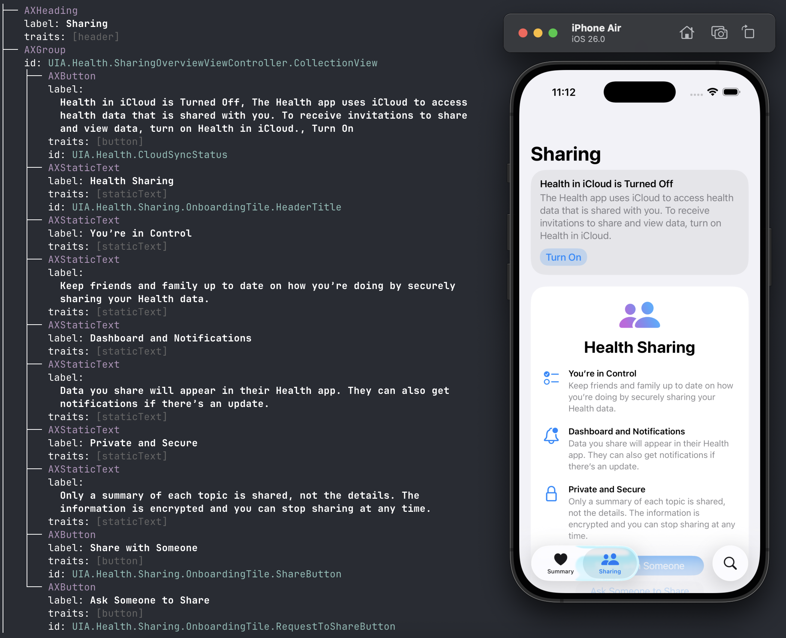

# xctree

A Swift command-line tool that extracts and displays the accessibility tree from iOS Simulator apps, similar to Xcode's Accessibility Inspector but as a CLI tool.



## Features

- Extract accessibility tree from running iOS Simulator apps
- Multiple output formats (tree view with colors, JSON)
- Smart text wrapping and formatting
- Comprehensive accessibility attribute support (role, label, value, traits, identifiers, hints)
- Built with Swift Package Manager for easy distribution

## Installation

### Via Homebrew

```bash
brew tap ldomaradzki/xctree
brew install xctree
```

### Build from Source

```bash
git clone https://github.com/ldomaradzki/xctree.git
cd xctree
swift build -c release
.build/release/xctree
```

## Usage

```bash
# Display tree of currently running iOS Simulator app
xctree

# Output as JSON
xctree --format json

# Disable colors
xctree --no-color

# Set custom width for text wrapping
xctree --width 120

# Show help
xctree --help
```

## Requirements

- macOS 15.0 (Sequoia) or later
- Xcode
- Running iOS Simulator instance
- Accessibility permissions for your terminal app (xctree will detect missing permissions and help you set them up on first run)

## Output Format

### Tree View (Default)

```
└── AXWindow
    label: Login Window
    ├── AXButton
    │   label: Submit
    │   traits: [button]
    │   id: submit_btn
    └── AXTextField
        label: Email Address
        value: user@example.com
        traits: [textField]
        id: email_field
```

### JSON Format

```json
{
  "identifier": "submit_btn",
  "label": "Submit",
  "role": "AXButton",
  "traits": ["button"]
}
```

## Architecture

xctree is built with a modular Swift Package Manager structure:

- **AXWrapper** - Library that wraps macOS Accessibility API
- **TreeFormatter** - Library for output formatting (tree view, JSON, colors)
- **xctree** - Executable that orchestrates the workflow

## Limitations

- Only works with iOS Simulator (not physical devices)
- Uses public macOS Accessibility API - some iOS UI elements may not be exposed (e.g., tab bar buttons in Xcode 26)
- Requires macOS 15.0+ and Accessibility permissions

## Testing

```bash
swift test
```

## License

MIT

## Contributing

Contributions welcome! Please feel free to submit issues or pull requests.
